# Safety and Fail-Safe Mechanisms

## Overview
Safety mechanisms for Autonomous-OP provide guaranteed-safe operations through sensor failure handling, communication loss recovery, battery-critical scenario management, and emergency override paths. These mechanisms ensure that autonomous operations always transition to known safe states in the event of failures.

## Design Principles
1. **Safety First** - Always prioritize human safety over efficiency
2. **Fail-Safe** - Transition to guaranteed-safe terminal states on failure
3. **Deterministic** - Predictable behavior in all failure scenarios
4. **Redundant** - Multiple independent safety checks
5. **Fast Response** - Millisecond-level reaction to critical failures
6. **Auditable** - Complete logging and traceability of safety decisions

## Safety Architecture

### Safety Control Loop
```
┌─────────────────────────────────────────────────────────────────┐
│                       Safety Control Loop                        │
├─────────────────────────────────────────────────────────────────┤
│                                                                 │
│  ┌──────────────┐  ┌──────────────┐  ┌──────────────┐          │
│  │   Sensor     │  │   Communication│  │   Battery    │          │
│  │  Monitoring  │  │   Monitoring  │  │  Monitoring  │          │
│  └──────┬───────┘  └──────┬───────┘  └──────┬───────┘          │
│         │                 │                 │                   │
│         └────────────┬────┴─────────────────┘                   │
│                      ▼                                           │
│              ┌──────────────┐                                    │
│              │   Safety     │                                    │
│              │  Assessment  │                                    │
│              └──────┬───────┘                                    │
│                     │                                            │
│         ┌───────────┴───────────┐                               │
│         ▼                       ▼                               │
│  ┌──────────────┐      ┌──────────────┐                          │
│  │   Decision   │      │   Priority   │                          │
│  │  Making      │      │  Resolution  │                          │
│  └──────┬───────┘      └──────┬───────┘                          │
│         │                     │                                  │
│         └──────────┬──────────┘                                  │
│                    ▼                                             │
│            ┌──────────────┐                                       │
│            │   Fail-Safe  │                                       │
│            │  Execution   │                                       │
│            └──────┬───────┘                                       │
│                   │                                               │
│         ┌──────────┴──────────┐                                  │
│         ▼                      ▼                                 │
│  ┌──────────────┐       ┌──────────────┐                        │
│  │   State      │       │   Recovery   │                        │
│  │  Transition  │       │  Mechanisms  │                        │
│  └──────┬───────┘       └──────┬───────┘                        │
│         │                      │                                 │
│         └──────────┬──────────┘                                 │
│                    ▼                                             │
│            ┌──────────────┐                                      │
│            │   Terminal   │                                      │
│            │  Safe States │                                      │
│            └──────────────┘                                      │
│                                                                 │
└─────────────────────────────────────────────────────────────────┘
```

## Decision Tables

### Sensor Failure Handling
| Sensor Type       | Failure Mode       | Priority | Response Action                          | Terminal State       | Recovery Time |
|-------------------|--------------------|----------|-------------------------------------------|---------------------|----------------|
| GPS               | No signal          | P1       | Stop movement, activate emergency beacon | STOPPED             | < 100ms        |
| Lidar             | Partial failure    | P2       | Reduce speed by 50%, activate warning     | SLOWED              | < 200ms        |
| Camera            | Complete failure   | P3       | Stop movement if vision-dependent         | STOPPED             | < 300ms        |
| Radar             | Intermittent       | P4       | Increase sensing interval, reduce speed 30% | REDUCED             | < 500ms        |
| IMU               | Drift              | P5       | Recalibrate, activate sensor fusion       | CALIBRATING          | < 1000ms       |

### Communication Loss Logic
| Communication Type   | Failure Duration  | Priority | Response Action                          | Terminal State       | Recovery Time |
|-----------------------|-------------------|----------|-------------------------------------------|---------------------|----------------|
| 5G/Cellular           | < 100ms            | P3       | Retry connection, continue normal operation | ACTIVE              | < 500ms        |
| 5G/Cellular           | 100ms - 1s         | P2       | Reduce speed 30%, activate local navigation | LOCAL_NAV           | < 1000ms       |
| 5G/Cellular           | 1s - 5s            | P1       | Stop movement, activate emergency beacon | STOPPED             | < 1500ms        |
| V2X                   | < 50ms             | P4       | Retry connection, continue normal operation | ACTIVE              | < 200ms        |
| V2X                   | 50ms - 500ms       | P2       | Increase safety margins, reduce speed 20% | CAUTIOUS            | < 500ms        |
| V2X                   | > 500ms            | P1       | Stop movement, activate emergency beacon | STOPPED             | < 1000ms        |

### Battery-Critical Scenarios
| Battery Level (%)  | Power State        | Priority | Response Action                          | Terminal State       | Recovery Time |
|---------------------|--------------------|----------|-------------------------------------------|---------------------|----------------|
| > 20%                | Normal             | P5       | Continue normal operation                 | ACTIVE              | -              |
| 15-20%               | Warning            | P4       | Reduce power consumption, limit speed to 30km/h | ECONOMY             | < 100ms        |
| 10-15%               | Critical           | P3       | Activate battery saver mode, find nearest charging station | RECHARGE            | < 500ms        |
| 5-10%                | Emergency          | P2       | Stop non-essential functions, head to charging station at 20km/h | EMERGENCY           | < 1000ms        |
| < 5%                 | Terminal           | P1       | Stop movement immediately, activate low power mode | SHUTDOWN            | < 500ms        |

### Emergency Override Paths
| Override Source      | Authorization Level | Priority | Response Action                          | Terminal State       | Recovery Time |
|-----------------------|----------------------|----------|-------------------------------------------|---------------------|----------------|
| Human Operator        | HIGH                 | P0       | Immediately transfer control, stop movement if requested | MANUAL              | < 50ms         |
| Remote Monitoring     | MEDIUM               | P0       | Stop movement, activate emergency beacon | STOPPED             | < 100ms        |
| Security System       | CRITICAL             | P0       | Immediately stop, secure vehicle          | LOCKED              | < 30ms         |
| Emergency Services    | CRITICAL             | P0       | Follow emergency instructions, clear area | EVACUATION          | < 200ms        |

## Priority Rules

### Failure Priority Levels
```kotlin
enum class PriorityLevel(val value: Int, val description: String) {
    P0(0, "Immediate Action Required (Emergency Override)"),
    P1(1, "Critical Failure (Safety Hazard)"),
    P2(2, "Major Failure (Limited Functionality)"),
    P3(3, "Moderate Failure (Degraded Performance)"),
    P4(4, "Minor Failure (Monitoring Only)"),
    P5(5, "Normal Operation")
}
```

### Decision Tree for Failure Handling
```
Root Decision: Handle Failure
├── Priority P0: Emergency Override
│   └── Immediate stop + manual control transfer
├── Priority P1: Critical Failure
│   ├── GPS failure > 1s
│   │   └── Stop + activate emergency beacon
│   ├── V2X failure > 500ms
│   │   └── Stop + activate emergency beacon
│   └── Battery < 5%
│       └── Immediate shutdown
├── Priority P2: Major Failure
│   ├── GPS failure 100ms-1s
│   │   └── Reduce speed 30% + local navigation
│   ├── V2X failure 50ms-500ms
│   │   └── Increase safety margins + reduce speed 20%
│   ├── Battery 5-10%
│   │   └── Stop non-essential functions + head to charging
│   └── Lidar partial failure
│       └── Reduce speed 50% + activate warning
├── Priority P3: Moderate Failure
│   ├── Camera complete failure
│   │   └── Stop if vision-dependent
│   ├── Battery 10-15%
│   │   └── Battery saver mode + find charging station
│   └── Communication loss 1s-5s
│       └── Stop movement + activate emergency beacon
├── Priority P4: Minor Failure
│   ├── Radar intermittent
│   │   └── Increase sensing interval + reduce speed 30%
│   ├── Battery 15-20%
│   │   └── Reduce power consumption + limit speed 30km/h
│   └── Communication loss < 100ms
│       └── Retry connection + continue operation
└── Priority P5: Normal Operation
    └── Continue with current task
```

## Guaranteed-Safe Terminal States

### Terminal State Definitions
```kotlin
enum class TerminalState(val description: String, val safetyLevel: String) {
    STOPPED("Vehicle stationary in safe location", "HIGH"),
    SLOWED("Vehicle moving at reduced speed with enhanced safety", "MEDIUM"),
    REDUCED("Vehicle operating with reduced functionality", "MEDIUM"),
    CALIBRATING("Sensor recalibration in progress", "MEDIUM"),
    LOCAL_NAV("Local navigation mode without external updates", "MEDIUM"),
    CAUTIOUS("Enhanced safety margins with reduced speed", "MEDIUM"),
    ECONOMY("Power saving mode with limited speed", "MEDIUM"),
    RECHARGE("Heading to nearest charging station", "MEDIUM"),
    EMERGENCY("Low power mode with minimal functionality", "MEDIUM"),
    SHUTDOWN("System shutdown, low power state", "HIGH"),
    MANUAL("Human operator control", "HIGH"),
    LOCKED("Vehicle secured and immobilized", "HIGH"),
    EVACUATION("Emergency evacuation mode", "HIGH")
}
```

### State Transition Diagram

```mermaid
graph TD
    ACTIVE[Active] -->|P0-P5 failure| STOPPED[Stopped]
    ACTIVE -->|P1-P4 failure| SLOWED[Slowed]
    ACTIVE -->|P2-P4 failure| REDUCED[Reduced]
    ACTIVE -->|P3-P4 failure| CALIBRATING[Calibrating]
    ACTIVE -->|P2-P3 failure| LOCAL_NAV[Local Nav]
    ACTIVE -->|P2-P3 failure| CAUTIOUS[Cautious]
    ACTIVE -->|P4 failure| ECONOMY[Economy]
    ACTIVE -->|P3 failure| RECHARGE[Recharge]
    ACTIVE -->|P2 failure| EMERGENCY[Emergency]
    ACTIVE -->|P1 failure| SHUTDOWN[Shutdown]
    ACTIVE -->|P0 override| MANUAL[Manual]
    ACTIVE -->|P0 security| LOCKED[Locked]
    ACTIVE -->|P0 emergency| EVACUATION[Evacuation]
    
    STOPPED -->|Recovery| ACTIVE
    SLOWED -->|Recovery| ACTIVE
    REDUCED -->|Recovery| ACTIVE
    CALIBRATING -->|Recovery| ACTIVE
    LOCAL_NAV -->|Recovery| ACTIVE
    CAUTIOUS -->|Recovery| ACTIVE
    ECONOMY -->|Recovery| ACTIVE
    RECHARGE -->|Recovery| ACTIVE
    EMERGENCY -->|Recovery| ACTIVE
    SHUTDOWN -->|Recovery| ACTIVE
    MANUAL -->|Recovery| ACTIVE
    LOCKED -->|Recovery| ACTIVE
    EVACUATION -->|Recovery| ACTIVE
```


## Safety Mechanisms Implementation

### Sensor Failure Detector
```kotlin
class SensorFailureDetector {
    suspend fun detectFailures(sensors: List<Sensor>): List<SensorFailure> {
        val failures = mutableListOf<SensorFailure>()
        
        sensors.forEach { sensor ->
            val reading = sensor.read()
            
            when {
                reading == null -> {
                    failures.add(SensorFailure(sensor.id, SensorFailureType.COMPLETE, PriorityLevel.P1))
                }
                sensor.type == SensorType.GPS && reading.accuracy > GPS_ACCURACY_THRESHOLD -> {
                    failures.add(SensorFailure(sensor.id, SensorFailureType.DRIFT, PriorityLevel.P2))
                }
                sensor.type == SensorType.CAMERA && reading.confidence < CAMERA_CONFIDENCE_THRESHOLD -> {
                    failures.add(SensorFailure(sensor.id, SensorFailureType.PARTIAL, PriorityLevel.P3))
                }
                sensor.type == SensorType.LIDAR && reading.range < LIDAR_MIN_RANGE -> {
                    failures.add(SensorFailure(sensor.id, SensorFailureType.PARTIAL, PriorityLevel.P2))
                }
                sensor.type == SensorType.RADAR && reading.signalStrength < RADAR_SIGNAL_THRESHOLD -> {
                    failures.add(SensorFailure(sensor.id, SensorFailureType.INTERMITTENT, PriorityLevel.P4))
                }
            }
        }
        
        return failures
    }
}

data class SensorFailure(
    val sensorId: String,
    val type: SensorFailureType,
    val priority: PriorityLevel,
    val timestamp: Long = System.currentTimeMillis()
)

enum class SensorFailureType {
    COMPLETE,
    PARTIAL,
    INTERMITTENT,
    DRIFT
}
```

### Communication Monitor
```kotlin
class CommunicationMonitor {
    suspend fun checkConnections(connections: List<Connection>): List<CommunicationFailure> {
        val failures = mutableListOf<CommunicationFailure>()
        
        connections.forEach { connection ->
            val status = connection.getStatus()
            
            when {
                status == ConnectionStatus.DISCONNECTED && connection.lastActive + CONNECTION_TIMEOUT > System.currentTimeMillis() -> {
                    failures.add(CommunicationFailure(connection.id, CommunicationFailureType.COMPLETE, PriorityLevel.P1))
                }
                status == ConnectionStatus.DEGRADED && connection.lastGoodSignal + SIGNAL_DEGRADE_TIMEOUT > System.currentTimeMillis() -> {
                    failures.add(CommunicationFailure(connection.id, CommunicationFailureType.DEGRADED, PriorityLevel.P2))
                }
                status == ConnectionStatus.INTERMITTENT && connection.interruptions > INTERRUPTION_THRESHOLD -> {
                    failures.add(CommunicationFailure(connection.id, CommunicationFailureType.INTERMITTENT, PriorityLevel.P3))
                }
            }
        }
        
        return failures
    }
}

data class CommunicationFailure(
    val connectionId: String,
    val type: CommunicationFailureType,
    val priority: PriorityLevel,
    val duration: Long = 0,
    val timestamp: Long = System.currentTimeMillis()
)

enum class CommunicationFailureType {
    COMPLETE,
    DEGRADED,
    INTERMITTENT
}
```

### Battery Monitor
```kotlin
class BatteryMonitor {
    suspend fun checkBattery(): BatteryState {
        val batteryInfo = getBatteryInfo()
        
        return when {
            batteryInfo.level < BATTERY_TERMINAL_THRESHOLD -> {
                BatteryState(batteryInfo.level, BatteryStatus.TERMINAL, PriorityLevel.P1, batteryInfo.voltage, batteryInfo.temperature)
            }
            batteryInfo.level < BATTERY_EMERGENCY_THRESHOLD -> {
                BatteryState(batteryInfo.level, BatteryStatus.EMERGENCY, PriorityLevel.P2, batteryInfo.voltage, batteryInfo.temperature)
            }
            batteryInfo.level < BATTERY_CRITICAL_THRESHOLD -> {
                BatteryState(batteryInfo.level, BatteryStatus.CRITICAL, PriorityLevel.P3, batteryInfo.voltage, batteryInfo.temperature)
            }
            batteryInfo.level < BATTERY_WARNING_THRESHOLD -> {
                BatteryState(batteryInfo.level, BatteryStatus.WARNING, PriorityLevel.P4, batteryInfo.voltage, batteryInfo.temperature)
            }
            else -> {
                BatteryState(batteryInfo.level, BatteryStatus.NORMAL, PriorityLevel.P5, batteryInfo.voltage, batteryInfo.temperature)
            }
        }
    }
}

data class BatteryState(
    val level: Double,
    val status: BatteryStatus,
    val priority: PriorityLevel,
    val voltage: Double,
    val temperature: Double,
    val timestamp: Long = System.currentTimeMillis()
)

enum class BatteryStatus {
    NORMAL,
    WARNING,
    CRITICAL,
    EMERGENCY,
    TERMINAL
}
```

### Emergency Override Handler
```kotlin
class EmergencyOverrideHandler {
    suspend fun handleOverride(request: OverrideRequest): TerminalState {
        val authenticated = authenticateOverride(request.source, request.credentials)
        
        if (!authenticated) {
            logger.warn("Unauthorized emergency override attempt from: ${request.source}")
            return TerminalState.ACTIVE
        }
        
        logger.error("Emergency override activated by: ${request.source}")
        
        return when (request.authorizationLevel) {
            AuthorizationLevel.CRITICAL -> {
                when (request.source) {
                    OverrideSource.SECURITY_SYSTEM -> TerminalState.LOCKED
                    OverrideSource.EMERGENCY_SERVICES -> TerminalState.EVACUATION
                    else -> TerminalState.MANUAL
                }
            }
            AuthorizationLevel.HIGH -> {
                TerminalState.MANUAL
            }
            AuthorizationLevel.MEDIUM -> {
                TerminalState.STOPPED
            }
            else -> {
                TerminalState.ACTIVE
            }
        }
    }
    
    private suspend fun authenticateOverride(source: OverrideSource, credentials: String): Boolean {
        return when (source) {
            OverrideSource.HUMAN_OPERATOR -> validateOperatorCredentials(credentials)
            OverrideSource.REMOTE_MONITORING -> validateRemoteMonitoringCredentials(credentials)
            OverrideSource.SECURITY_SYSTEM -> validateSecuritySystemCredentials(credentials)
            OverrideSource.EMERGENCY_SERVICES -> validateEmergencyServicesCredentials(credentials)
        }
    }
}

data class OverrideRequest(
    val source: OverrideSource,
    val authorizationLevel: AuthorizationLevel,
    val credentials: String,
    val timestamp: Long = System.currentTimeMillis()
)

enum class OverrideSource {
    HUMAN_OPERATOR,
    REMOTE_MONITORING,
    SECURITY_SYSTEM,
    EMERGENCY_SERVICES
}

enum class AuthorizationLevel {
    CRITICAL,
    HIGH,
    MEDIUM,
    LOW
}
```

## Safety Decision Engine
```kotlin
class SafetyDecisionEngine {
    suspend fun makeDecision(failures: List<Failure>, overrides: List<OverrideRequest>): SafetyDecision {
        // Handle emergency overrides first
        if (overrides.isNotEmpty()) {
            val highestPriorityOverride = overrides.maxByOrNull { it.authorizationLevel.ordinal }!!
            val terminalState = EmergencyOverrideHandler().handleOverride(highestPriorityOverride)
            
            return SafetyDecision(
                decisionType = DecisionType.EMERGENCY_OVERRIDE,
                terminalState = terminalState,
                priority = PriorityLevel.P0,
                description = "Emergency override from: ${highestPriorityOverride.source}"
            )
        }
        
        // Find highest priority failure
        val highestPriorityFailure = failures.maxByOrNull { it.priority.value }
        
        if (highestPriorityFailure == null) {
            return SafetyDecision(
                decisionType = DecisionType.CONTINUE,
                terminalState = TerminalState.ACTIVE,
                priority = PriorityLevel.P5,
                description = "Normal operation"
            )
        }
        
        // Determine response based on failure type and priority
        return when (highestPriorityFailure.priority) {
            PriorityLevel.P1 -> handleCriticalFailure(highestPriorityFailure)
            PriorityLevel.P2 -> handleMajorFailure(highestPriorityFailure)
            PriorityLevel.P3 -> handleModerateFailure(highestPriorityFailure)
            PriorityLevel.P4 -> handleMinorFailure(highestPriorityFailure)
            else -> SafetyDecision(
                decisionType = DecisionType.CONTINUE,
                terminalState = TerminalState.ACTIVE,
                priority = PriorityLevel.P5,
                description = "Normal operation"
            )
        }
    }
    
    private suspend fun handleCriticalFailure(failure: Failure): SafetyDecision {
        val terminalState = when (failure) {
            is SensorFailure -> {
                if (failure.sensorType == SensorType.GPS && failure.duration > 1000) {
                    TerminalState.STOPPED
                } else if (failure.sensorType == SensorType.GPS && failure.duration > 100) {
                    TerminalState.LOCAL_NAV
                } else {
                    TerminalState.STOPPED
                }
            }
            is CommunicationFailure -> {
                if (failure.connectionType == ConnectionType.V2X && failure.duration > 500) {
                    TerminalState.STOPPED
                } else if (failure.connectionType == ConnectionType.V2X && failure.duration > 50) {
                    TerminalState.CAUTIOUS
                } else {
                    TerminalState.STOPPED
                }
            }
            is BatteryState -> {
                if (failure.level < 5) {
                    TerminalState.SHUTDOWN
                } else if (failure.level < 10) {
                    TerminalState.EMERGENCY
                } else {
                    TerminalState.STOPPED
                }
            }
            else -> TerminalState.STOPPED
        }
        
        return SafetyDecision(
            decisionType = DecisionType.STOP,
            terminalState = terminalState,
            priority = PriorityLevel.P1,
            description = "Critical failure handled"
        )
    }
    
    private suspend fun handleMajorFailure(failure: Failure): SafetyDecision {
        val terminalState = when (failure) {
            is SensorFailure -> {
                if (failure.sensorType == SensorType.LIDAR && failure.type == SensorFailureType.PARTIAL) {
                    TerminalState.SLOWED
                } else if (failure.sensorType == SensorType.CAMERA && failure.type == SensorFailureType.COMPLETE) {
                    TerminalState.STOPPED
                } else {
                    TerminalState.SLOWED
                }
            }
            is CommunicationFailure -> {
                if (failure.connectionType == ConnectionType.CELLULAR && failure.duration > 1000) {
                    TerminalState.STOPPED
                } else if (failure.connectionType == ConnectionType.CELLULAR && failure.duration > 100) {
                    TerminalState.LOCAL_NAV
                } else {
                    TerminalState.SLOWED
                }
            }
            is BatteryState -> {
                if (failure.level < 15) {
                    TerminalState.RECHARGE
                } else {
                    TerminalState.ECONOMY
                }
            }
            else -> TerminalState.SLOWED
        }
        
        return SafetyDecision(
            decisionType = DecisionType.REDUCE_SPEED,
            terminalState = terminalState,
            priority = PriorityLevel.P2,
            description = "Major failure handled"
        )
    }
    
    private suspend fun handleModerateFailure(failure: Failure): SafetyDecision {
        val terminalState = when (failure) {
            is SensorFailure -> {
                if (failure.sensorType == SensorType.RADAR && failure.type == SensorFailureType.INTERMITTENT) {
                    TerminalState.REDUCED
                } else {
                    TerminalState.CALIBRATING
                }
            }
            is CommunicationFailure -> {
                TerminalState.LOCAL_NAV
            }
            is BatteryState -> {
                TerminalState.RECHARGE
            }
            else -> TerminalState.CALIBRATING
        }
        
        return SafetyDecision(
            decisionType = DecisionType.CALIBRATE,
            terminalState = terminalState,
            priority = PriorityLevel.P3,
            description = "Moderate failure handled"
        )
    }
    
    private suspend fun handleMinorFailure(failure: Failure): SafetyDecision {
        val terminalState = when (failure) {
            is SensorFailure -> {
                TerminalState.REDUCED
            }
            is CommunicationFailure -> {
                TerminalState.ACTIVE
            }
            is BatteryState -> {
                TerminalState.ECONOMY
            }
            else -> TerminalState.ACTIVE
        }
        
        return SafetyDecision(
            decisionType = DecisionType.MONITOR,
            terminalState = terminalState,
            priority = PriorityLevel.P4,
            description = "Minor failure handled"
        )
    }
}

data class SafetyDecision(
    val decisionType: DecisionType,
    val terminalState: TerminalState,
    val priority: PriorityLevel,
    val description: String,
    val timestamp: Long = System.currentTimeMillis()
)

enum class DecisionType {
    CONTINUE,
    MONITOR,
    CALIBRATE,
    REDUCE_SPEED,
    STOP,
    EMERGENCY_OVERRIDE
}
```

## Configuration

### Safety Configuration
```yaml
logi:
  autonomous:
    safety:
      enabled: true
      # Sensor failure thresholds
      sensor:
        gps_accuracy_threshold: 10.0  # meters
        camera_confidence_threshold: 0.7
        lidar_min_range: 0.5  # meters
        radar_signal_threshold: 0.3
      # Communication failure thresholds
      communication:
        connection_timeout: 1000  # ms
        signal_degrade_timeout: 5000  # ms
        interruption_threshold: 3  # per minute
      # Battery failure thresholds
      battery:
        normal_threshold: 20.0  # %
        warning_threshold: 15.0  # %
        critical_threshold: 10.0  # %
        emergency_threshold: 5.0  # %
        terminal_threshold: 2.0  # %
        temperature_threshold: 45.0  # °C
      # Response times
      response:
        critical_response_time: 100  # ms
        major_response_time: 200  # ms
        moderate_response_time: 500  # ms
        minor_response_time: 1000  # ms
      # Safety margins
      safety_margins:
        normal_speed: 60  # km/h
        reduced_speed: 30  # km/h
        emergency_speed: 20  # km/h
        stopping_distance: 5.0  # meters
      # Recovery settings
      recovery:
        retry_count: 3
        retry_interval: 1000  # ms
        recovery_timeout: 60000  # ms
      # Logging
      logging:
        detailed_logging: true
        audit_logging: true
```

## Metrics

### Prometheus Metrics
```
# Safety Metrics
autonomous_ops_safety_failures_total
autonomous_ops_safety_failures_critical
autonomous_ops_safety_failures_major
autonomous_ops_safety_failures_moderate
autonomous_ops_safety_failures_minor
autonomous_ops_safety_override_count
autonomous_ops_safety_response_time_seconds
autonomous_ops_safety_terminal_state_duration_seconds
autonomous_ops_safety_sensor_failure_count
autonomous_ops_safety_communication_failure_count
autonomous_ops_safety_battery_critical_events
```

## Logging

### Safety Event Logs
```json
{
  "timestamp": "2024-02-06T22:45:00Z",
  "level": "ERROR",
  "eventType": "SENSOR_FAILURE",
  "priority": "P1",
  "sensorId": "GPS-001",
  "failureType": "COMPLETE",
  "duration": 1200,
  "responseTime": 95,
  "terminalState": "STOPPED",
  "location": {"lat": 51.5074, "lon": -0.1278},
  "systemState": {"speed": 0, "batteryLevel": 85}
}
```

### Audit Trail
```json
{
  "auditId": "SAFETY-2024-001",
  "timestamp": "2024-02-06T22:45:00Z",
  "userId": "system",
  "action": "EMERGENCY_OVERRIDE",
  "source": "SECURITY_SYSTEM",
  "authorizationLevel": "CRITICAL",
  "description": "Security system emergency override activated",
  "terminalState": "LOCKED",
  "location": {"lat": 51.5074, "lon": -0.1278},
  "hash": "sha256:abc123..."
}
```

## Usage Example

### Safety Integration in Autonomous-OP
```kotlin
fun main() {
    runBlocking {
        val safetyEngine = SafetyDecisionEngine()
        val sensorDetector = SensorFailureDetector()
        val communicationMonitor = CommunicationMonitor()
        val batteryMonitor = BatteryMonitor()
        val emergencyHandler = EmergencyOverrideHandler()
        
        // Initialize system
        val sensors = listOf(
            Sensor("GPS-001", SensorType.GPS),
            Sensor("LIDAR-001", SensorType.LIDAR),
            Sensor("CAMERA-001", SensorType.CAMERA),
            Sensor("RADAR-001", SensorType.RADAR),
            Sensor("IMU-001", SensorType.IMU)
        )
        
        val connections = listOf(
            Connection("CELL-001", ConnectionType.CELLULAR),
            Connection("V2X-001", ConnectionType.V2X)
        )
        
        // Safety loop
        launch {
            while (isActive) {
                // Detect failures
                val sensorFailures = sensorDetector.detectFailures(sensors)
                val communicationFailures = communicationMonitor.checkConnections(connections)
                val batteryState = batteryMonitor.checkBattery()
                
                // Check for emergency overrides
                val overrides = checkEmergencyOverrides()
                
                // Make safety decision
                val decision = safetyEngine.makeDecision(
                    sensorFailures + communicationFailures + listOf(batteryState),
                    overrides
                )
                
                // Execute decision
                executeDecision(decision)
                
                // Log decision
                logger.info("Safety decision: $decision")
                
                // Monitor recovery
                if (decision.priority < PriorityLevel.P5) {
                    monitorRecovery(decision)
                }
                
                delay(100)
            }
        }
        
        // Emergency override listener
        launch {
            emergencyHandler.listenForOverrides { request ->
                logger.error("Emergency override request received: $request")
                safetyEngine.makeDecision(emptyList(), listOf(request)).let { decision ->
                    executeDecision(decision)
                    logger.info("Emergency decision executed: $decision")
                }
            }
        }
    }
}

suspend fun checkEmergencyOverrides(): List<OverrideRequest> {
    return emptyList()
}

suspend fun executeDecision(decision: SafetyDecision) {
    when (decision.terminalState) {
        TerminalState.STOPPED -> stopVehicle()
        TerminalState.SLOWED -> reduceSpeed(0.5)
        TerminalState.REDUCED -> reduceFunctionality()
        TerminalState.CALIBRATING -> calibrateSensors()
        TerminalState.LOCAL_NAV -> activateLocalNavigation()
        TerminalState.CAUTIOUS -> increaseSafetyMargins()
        TerminalState.ECONOMY -> activateBatterySaver()
        TerminalState.RECHARGE -> navigateToChargingStation()
        TerminalState.EMERGENCY -> activateEmergencyMode()
        TerminalState.SHUTDOWN -> shutdownSystem()
        TerminalState.MANUAL -> transferToManualControl()
        TerminalState.LOCKED -> lockVehicle()
        TerminalState.EVACUATION -> activateEvacuationMode()
    }
}

suspend fun stopVehicle() {
    // Emergency stop
}

suspend fun reduceSpeed(factor: Double) {
    // Reduce speed by factor
}

suspend fun reduceFunctionality() {
    // Disable non-essential features
}

suspend fun calibrateSensors() {
    // Recalibrate sensors
}

suspend fun activateLocalNavigation() {
    // Switch to local navigation
}

suspend fun increaseSafetyMargins() {
    // Increase stopping distance and safety margins
}

suspend fun activateBatterySaver() {
    // Activate battery saving mode
}

suspend fun navigateToChargingStation() {
    // Calculate route to nearest charging station
}

suspend fun activateEmergencyMode() {
    // Emergency power saving mode
}

suspend fun shutdownSystem() {
    // System shutdown
}

suspend fun transferToManualControl() {
    // Transfer control to human operator
}

suspend fun lockVehicle() {
    // Secure and immobilize vehicle
}

suspend fun activateEvacuationMode() {
    // Clear area and follow emergency instructions
}

suspend fun monitorRecovery(decision: SafetyDecision) {
    val startTime = System.currentTimeMillis()
    
    while (System.currentTimeMillis() - startTime < RECOVERY_TIMEOUT) {
        if (checkRecovery(decision.terminalState)) {
            executeDecision(SafetyDecision(
                decisionType = DecisionType.CONTINUE,
                terminalState = TerminalState.ACTIVE,
                priority = PriorityLevel.P5,
                description = "Recovery successful"
            ))
            return
        }
        
        delay(1000)
    }
    
    logger.error("Recovery failed, maintaining safe state: ${decision.terminalState}")
}

suspend fun checkRecovery(targetState: TerminalState): Boolean {
    return true
}
```

## Conclusion
Safety and fail-safe mechanisms for Autonomous-OP provide comprehensive protection against sensor failures, communication loss, battery-critical scenarios, and emergency situations. The system ensures that operations always transition to known safe states with millisecond-level response times, providing both human and environmental safety. The architecture includes redundancy, deterministic behavior, and complete audit trail for regulatory compliance and post-incident analysis.